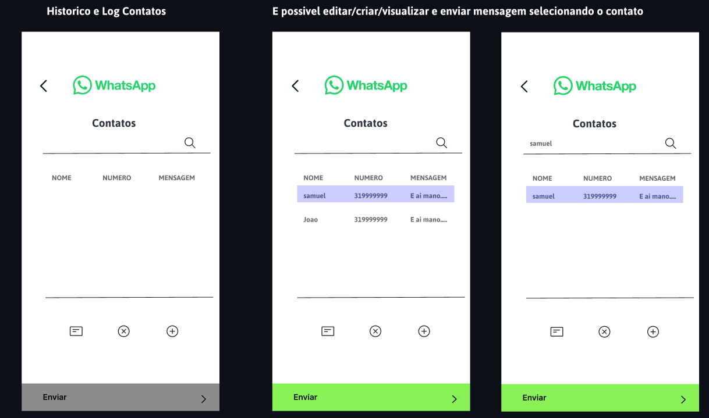
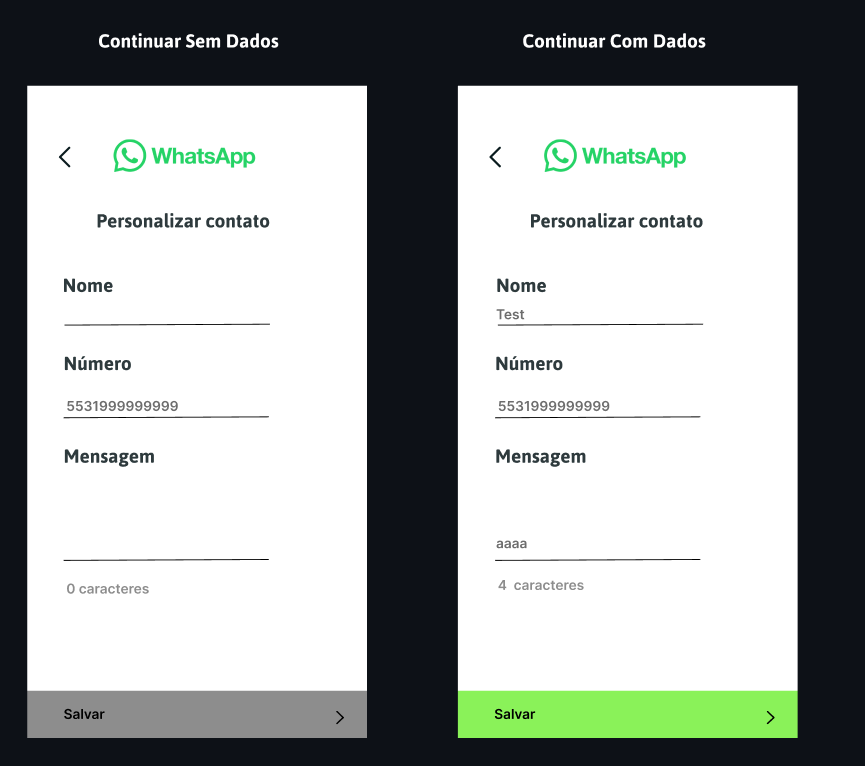

# Bot WhatsApp - SAMUELFLM

<!---Esses são exemplos. Veja https://shields.io para outras pessoas ou para personalizar este conjunto de escudos. Você pode querer incluir dependências, status do projeto e informações de licença aqui--->


> Um bot que faz envio de mensagem unica ou em massa... Faca o uso e se surpreenda!!

### Progresso

> Esta sendo utilizado as seguintes bibliotecas 

```shell
pip install pyautogui
pip install selenium
pip install pysimplegui
```
> Interacao Inicial com Usuario


> Nessa pagina o usuario vai ter total controle dos seus contatos para envio de mensagem automatica




> Aqui deve ser informado o nome, numero de telefone e uma mensagem



<h1>Interface Home</h1>

